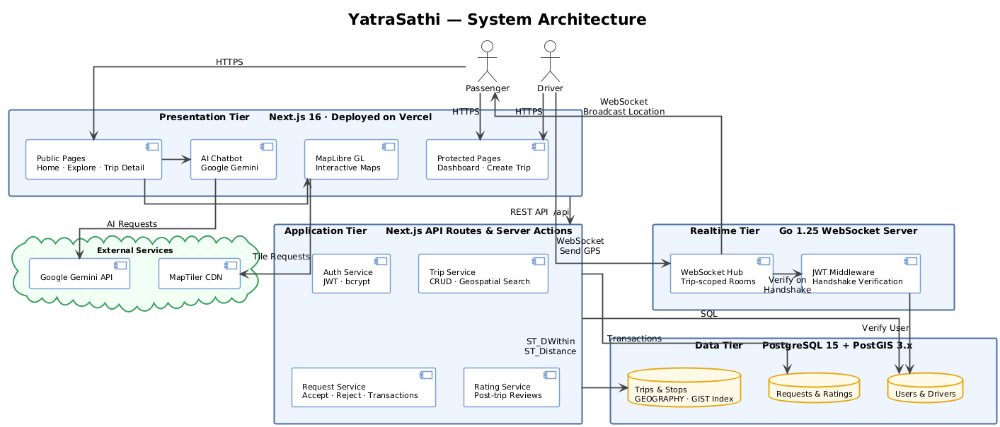
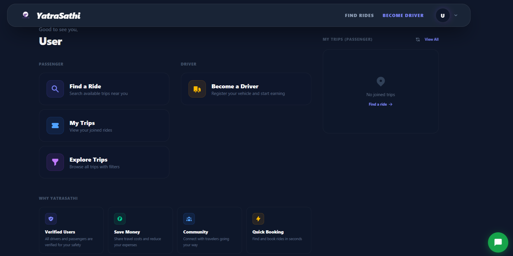
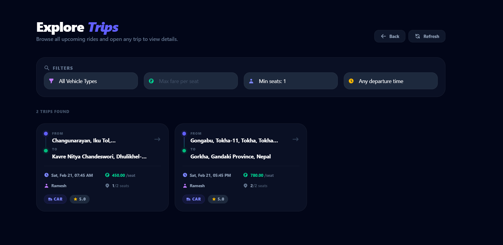
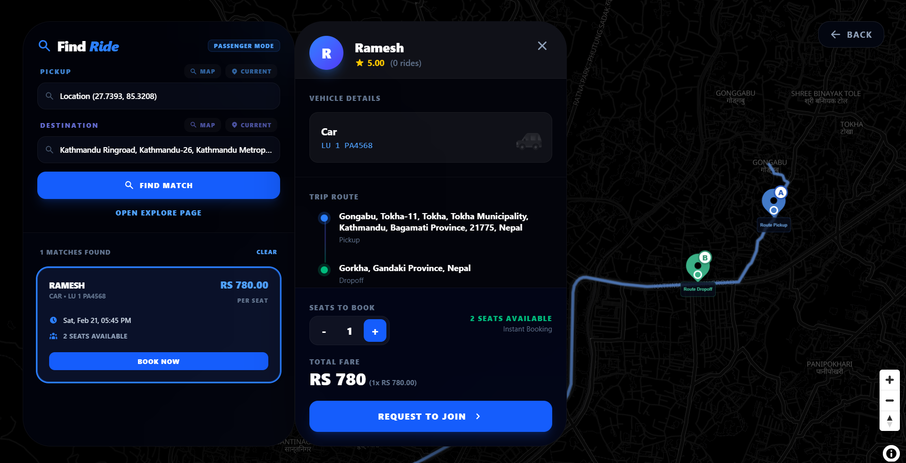
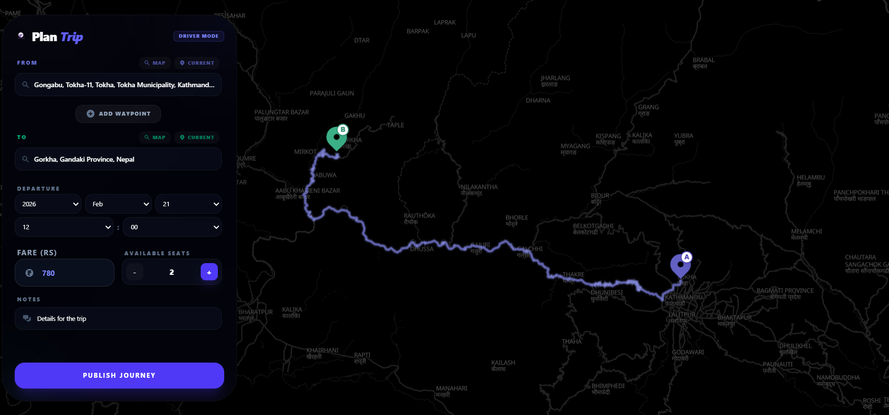
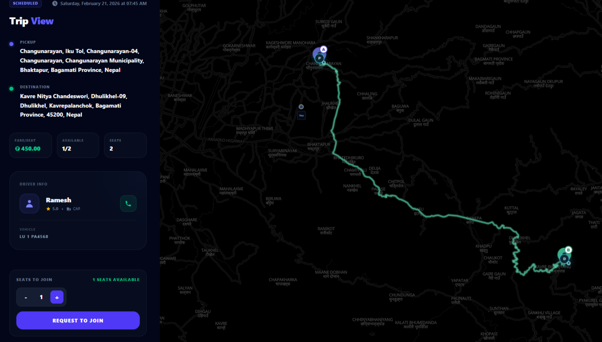
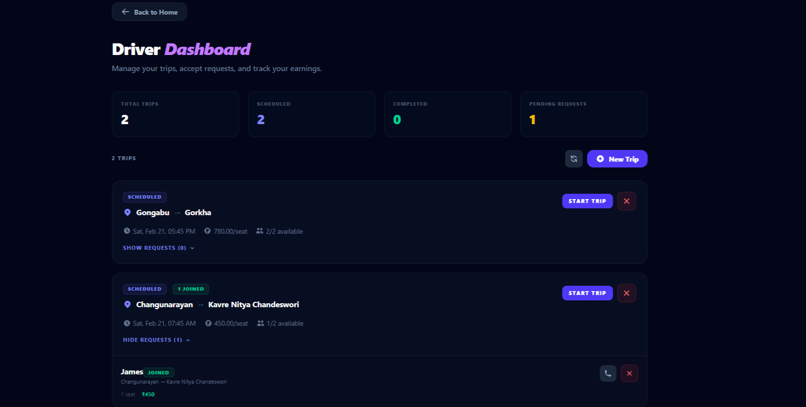
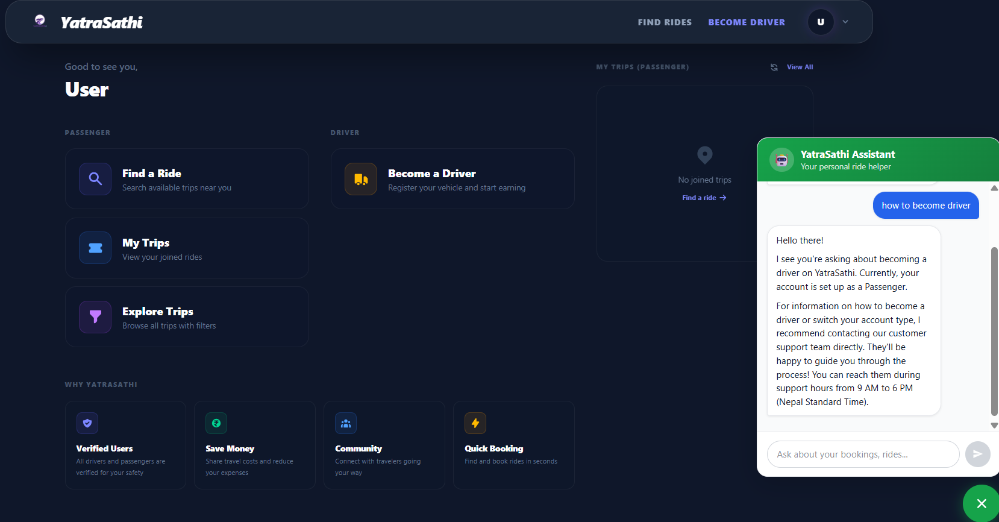

<div align="center">

# यात्रासाथी · YatraSathi

### Trip Sharing & Vehicle Booking Web Application

*"Travel Companion" — Connecting drivers and passengers for smarter, social, and affordable journeys*

**🌐 Live Deployment:** [https://yatra-sathi-black.vercel.app/](https://yatra-sathi-black.vercel.app/)

---

### 👥 Team Members

| Name | Roll No. |
|---|---|
| Bikesh Sah | 080BCT010 |
| Mukunda Chaudhary | 080BCT020 |
| Pramish Marasini | 080BCT024 |

---

</div>

## 📋 Table of Contents

1. [Project Overview](#1-project-overview)
2. [Executive Summary](#2-executive-summary)
3. [Problem Statement](#3-problem-statement)
4. [Objectives](#4-objectives)
5. [System Architecture](#5-system-architecture)
6. [Technology Stack](#6-technology-stack)
7. [Database Design](#7-database-design)
8. [PostGIS & Geospatial Query Implementation](#8-postgis--geospatial-query-implementation)
9. [Real-Time Communication](#9-real-time-communication)
10. [Authentication & Security](#10-authentication--security)
11. [Trip Lifecycle Flow](#11-trip-lifecycle-flow)
12. [Ride Request Management](#12-ride-request-management)
13. [Rating System](#13-rating-system)
14. [Database Optimization Techniques](#14-database-optimization-techniques)
15. [Key Features](#15-key-features)
16. [Screenshots](#16-screenshots)
17. [Pages & Routes](#17-pages--routes)
18. [Project Structure](#18-project-structure)
19. [Installation & Setup](#19-installation--setup)
20. [Environment Variables](#20-environment-variables)
21. [Future Enhancements](#21-future-enhancements)
22. [Conclusion](#22-conclusion)

---

## 1. Project Overview

**YatraSathi** (Nepali: यात्रासाथी — *"Travel Companion"*) is a full-stack, real-time trip sharing and vehicle booking web application built for the modern traveller. It connects drivers who have spare seats with passengers who need a ride — making travel smarter, social, and affordable.

The platform supports the complete lifecycle of a shared trip: from a driver creating and broadcasting a trip, to passengers discovering and joining it, through to live GPS tracking of the journey in real time. Built as a capstone submission for the Database Management Systems course, **YatraSathi** demonstrates the practical application of advanced DBMS concepts including spatial indexing with **PostGIS**, relational schema design, transaction management, query optimization, and real-time **WebSocket** communication.

The application is fully deployed and live at [https://yatra-sathi-black.vercel.app/](https://yatra-sathi-black.vercel.app/).

---

## 2. Executive Summary

**YatraSathi** is architected across two server runtimes — a **Next.js 16** application handling the REST API, server-side rendering, and all business logic, and a dedicated **Go 1.25** realtime server responsible exclusively for **WebSocket** connections and live GPS broadcasting. **PostgreSQL** serves as the single source of truth, with the **PostGIS** extension enabling geography-aware trip discovery.

Key technical accomplishments of the project include:

- Geospatial trip matching using **PostGIS ST_Intersects** against route buffers for efficient pickup/dropoff proximity matching along the entire trip path
- A trip-specific **WebSocket Hub** pattern in Go that broadcasts driver location updates only to passengers participating in that specific trip
- Fully custom **JWT-based authentication** with HTTP-only cookie sessions and **Next.js middleware**-enforced route protection (via route groupings and server-side session validation)
- An integrated **AI chatbot** powered by **Google Gemini** for in-app trip guidance and travel assistance
- A normalized relational schema designed with PostGIS spatial types, transactions, and strategic indexing across all entities

---

## 3. Problem Statement

Urban and intercity commuters frequently face the dual burden of high transportation costs and fragmented travel options. Private vehicle drivers, meanwhile, routinely travel with empty seats — a wasted logistical and environmental opportunity. Existing commercial ride-sharing platforms impose high commission structures, lack transparency, and are not designed for social or community-oriented carpooling.

There is a clear need for a **community-first trip sharing platform** that:

- Allows drivers to openly broadcast trips and passengers to discover them by location and preference
- Provides **real-time GPS tracking** to improve safety, punctuality, and trust between parties
- Handles the full request-approval workflow between drivers and passengers
- Maintains accountability through **peer ratings** and a driver verification system
- Offers **AI-assisted guidance** to reduce friction for first-time users

YatraSathi is designed to address all of these challenges through principled database design, geospatial querying, and a dual-server real-time architecture.

---

## 4. Objectives

- **1** — Design and implement a normalized relational database schema covering users, drivers, vehicles, trips, ride requests, and ratings.
- **2** — Integrate **PostGIS** spatial extensions for geography-aware trip discovery using coordinate-based proximity queries.
- **3** — Implement a dedicated **Go WebSocket** server with a Hub pattern for trip-scoped live GPS broadcasting.
- **4** — Build a secure, custom **JWT** authentication system with HTTP-only cookie sessions and role-based route protection.
- **5** — Develop an interactive, map-driven frontend using **Next.js 16**, **MapLibre GL**, and **Zustand** for global state management.
- **6** — Integrate **Google Gemini** to provide an in-app AI travel assistant on the platform homepage.
- **7** — Apply database optimization techniques including spatial and B-Tree indexing, query planning, and connection pooling.
- **8** — Deploy the application to a publicly accessible production environment on **Vercel**.

---

## 5. System Architecture

**YatraSathi** is built on a **split-server Three-Tier Architecture**, separating concerns across four distinct layers: Presentation, Application, Realtime, and Data. The **Next.js** application serves as both the presentation and primary application tier, while a separate **Go** server handles exclusively the real-time communication layer. **PostgreSQL** with **PostGIS** underpins both servers as the single source of truth.


*Figure: YatraSathi three-tier system architecture — Presentation → Application → Realtime → Data*

### 5.1 Presentation Tier — Next.js 16 · Vercel

The **Next.js 16** App Router application handles all user-facing pages using a combination of **Server Components** for SEO and initial data loading, and **Client Components** for interactive map views, live tracking, and form interactions. Route protection is enforced at the **middleware** layer before any page renders. **Zustand** manages global client-side state across auth, trip search, and live tracking.

### 5.2 Application Tier — Next.js API Routes & Server Actions

All business logic — authentication, trip management, ride requests, and ratings — is handled through **Next.js Server Actions** and **API routes**. These communicate with **PostgreSQL** via a `pg` connection pool and enforce role-based access control using **JWT** claims extracted from HTTP-only cookies.

### 5.3 Realtime Tier — Go 1.25 WebSocket Server

A dedicated **Go 1.25** server handles all **WebSocket** connections. It maintains an in-memory **Hub** that maps each `trip_id` to a set of connected clients. When a driver broadcasts a GPS update, the hub fans it out exclusively to all passengers in that trip's room. This server has no REST endpoints — it exists solely for low-latency bidirectional communication.

### 5.4 Data Tier — PostgreSQL 15 + PostGIS 3.x

**PostgreSQL 15** with the **PostGIS** extension stores all persistent state. Geographic coordinates are stored as `GEOGRAPHY(POINT, 4326)` values, enabling accurate real-world distance calculations. **GIST spatial indexes** ensure proximity queries remain performant at scale. **PL/pgSQL triggers** automate rating aggregation.

---

## 6. Technology Stack

### 6.1 Frontend

| Technology | Version | Purpose |
|---|---|---|
| **Next.js** | 16 | App Router, Server Components, SSR, server actions, API routes |
| **TypeScript** | 5.x | Static typing throughout the frontend and server actions |
| **Tailwind CSS** | v4 | Utility-first CSS with custom design tokens |
| **Zustand** | Latest | Global state stores for auth, trips, UI, and live tracking |
| **MapLibre GL** + react-map-gl | Latest | WebGL map rendering, route visualization, live tracking view |
| **Google Gemini** (`@google/generative-ai`) | Latest | AI chatbot for in-app travel assistance |
| **Sonner** | Latest | Toast notification system |
| **react-icons** | Latest | Icon library |
| **Nodemailer** | Latest | Transactional email delivery |
| **pg** | Latest | PostgreSQL client for Next.js server-side queries |

### 6.2 Backend (Go Realtime Server)

| Technology | Version | Purpose |
|---|---|---|
| **Go** | 1.25 | High-performance realtime server runtime |
| **gorilla/websocket** | Latest | WebSocket protocol implementation |
| **golang-jwt/jwt** | v5 | JWT claim verification for WebSocket handshakes |
| **pgx/v5** | v5 | High-performance PostgreSQL connection pool |
| **godotenv** | Latest | Environment variable loading |

### 6.3 Database

| Technology | Version | Purpose |
|---|---|---|
| **PostgreSQL** | 15+ | Primary relational database |
| **PostGIS** | 3.x | Spatial extension for geographic data types and functions |
| **GIST Index** | — | Generalized Search Tree for spatial column indexing |

---

## 7. Database Design

The database schema is designed to **Third Normal Form (3NF)**, eliminating transitive dependencies while maintaining referential integrity across all entities. Seven primary tables manage the full application domain.

### 7.1 Entity Overview

**Users** form the root entity for all registered accounts. Every person on the platform — whether a passenger or a driver — has a corresponding user record. The `role` field distinguishes between passenger and driver accounts.

**Drivers** extend the user entity with driver-specific identity information, including license details and a running average rating. The relationship between users and drivers is one-to-one — a user may optionally register as a driver.

**Vehicles** store vehicle details (type, model, registration plate, and seat capacity) associated with a registered driver. A driver may own multiple vehicles, creating a one-to-many relationship between drivers and vehicles.

**Trips** are the central entity. Each trip belongs to a driver and is associated with a specific vehicle. Trips carry spatial origin and destination coordinates, departure time, available seats, fare per seat, and a lifecycle status field.

**Trip Stops** represent optional ordered intermediate waypoints along a trip's route, each with its own spatial coordinate and sequence number.

**Ride Requests** manage passenger join requests for a given trip. Each request tracks the requesting passenger, the number of seats requested, and an approval status managed by the driver from their dashboard.

**Ratings** record post-trip peer ratings between drivers and passengers, storing a numeric score and an optional written review. Ratings are bidirectional — both parties may rate each other after a completed trip.

### 7.2 Entity-Relationship Overview

```
users ──────────────── drivers ──────────── vehicles
  │                      │                    │
  │                    trips ◀────────────────┘
  │                      │
  │                  trip_stops
  │
  ├──── ride_requests ──▶ trips
  │
  └──── ratings
```

### 7.3 Table Summary

| Table | Primary Key | Description |
|---|---|---|
| `users` | UUID | All registered accounts — passengers and drivers |
| `drivers` | UUID | Driver profiles linked one-to-one with a user |
| `vehicles` | UUID | Vehicle details owned by a driver |
| `trips` | UUID | Trip listings created by drivers with spatial coordinates |
| `trip_stops` | UUID | Ordered intermediate stops along a trip route |
| `ride_requests` | UUID | Passenger join requests with approval status |
| `ratings` | UUID | Post-trip peer scores and reviews |

### 7.4 Relationships Summary

| Relationship | Cardinality | Notes |
|---|---|---|
| `users` → `drivers` | 1 : 0..1 | A user may optionally register as a driver |
| `drivers` → `vehicles` | 1 : N | A driver may own multiple vehicles |
| `drivers` → `trips` | 1 : N | A driver can host many trips |
| `vehicles` → `trips` | 1 : N | A vehicle is associated with many trips |
| `trips` → `trip_stops` | 1 : N | A trip may have multiple ordered stops |
| `trips` → `ride_requests` | 1 : N | Multiple passengers can request a trip |
| `users` → `ride_requests` | 1 : N | A user can request multiple trips |
| `trips` → `ratings` | 1 : N | Multiple ratings submitted per completed trip |

### 7.5 Constraints & Integrity Rules

All primary keys use **UUID** values generated at the database level for globally unique, non-sequential identifiers. **Foreign key constraints** use `ON DELETE CASCADE` where entity lifecycle is tightly coupled, and restrict deletion elsewhere to preserve historical data such as ratings.

**Domain-level CHECK constraints** enforce business rules directly in the database: `available_seats` must be zero or greater, `fare_per_seat` must be non-negative, `score` must fall between 1 and 5, and `total_seats` must be between 1 and 20.

**UNIQUE constraints** on `(trip_id, passenger_id)` in ride requests prevent duplicate booking submissions, and on `(trip_id, rater_id, ratee_id)` in ratings prevent duplicate reviews for the same trip pairing. Vehicle registration plates are globally unique across the system.

---

## 8. PostGIS & Geospatial Query Implementation

**PostGIS** is the backbone of YatraSathi's trip discovery feature. All geographic coordinates are stored using the `GEOGRAPHY` data type with **SRID 4326** — the WGS 84 coordinate reference system used by GPS — which enables all distance calculations in real-world meters rather than arbitrary planar units.

### 8.1 Spatial Data Storage

Every origin, destination, and stop location is stored as a `GEOGRAPHY(POINT, 4326)` column. This type choice over the simpler `POINT` type is deliberate: geography-aware calculations account for the Earth's curvature, producing accurate metric distances at any scale.

### 8.2 Proximity-Based Trip Search

The **Explore** page uses `ST_Intersects` against a pre-calculated 100-meter buffer (`buffer_100`) of the trip's route to find all trips that pass near the passenger's requested pickup and dropoff locations. This route-aware matching is more powerful than simple point-to-point proximity as it allows passengers to join trips that are already passing through their area.

### 8.3 Route Logic & Sequencing

To ensure valid trips, the system verifies that the pickup point occurs before the dropoff point along the driver's route using `ST_LineLocatePoint`. This prevents surfacing trips that are traveling in the opposite direction or have already passed the pickup point.

### 8.4 GIST Index — Spatial Indexing

Without spatial indexing, geographic queries would require full sequential scans. PostgreSQL's **Generalized Search Tree (GIST)** indexes are maintained on the route geometry, buffer, start/end points, and trip locations to ensure that spatial lookups remain performant even as the dataset grows.

**Performance impact on 100,000 trip rows:**

| Query | Without GIST | With GIST |
|---|---|---|
| `ST_DWithin` proximity search | ~175ms (seq scan) | ~2ms (index scan) |
| `ST_Distance` order-by | ~210ms | ~4ms |

### 8.5 Combined Spatial + Column Filters

The **Explore** page supports filtering by both geographic proximity and vehicle type simultaneously, combining a **GIST index scan** with a **B-Tree index scan** in a single query plan. The `status = 'scheduled'` and `available_seats > 0` filters further reduce the working set before spatial evaluation.

---

## 9. Real-Time Communication

### 9.1 Architecture Overview

YatraSathi's live GPS tracking uses a **dedicated Go WebSocket server** running separately from the Next.js application. This separation keeps the realtime path isolated from the REST API, eliminates interference between long-lived connections and HTTP request handling, and allows the realtime layer to scale independently.

```
Driver Browser          Go WebSocket Hub         Passenger Browser(s)
      │                        │                         │
      │── connect /ws/{tripId}▶│                         │
      │                        │◀── connect /ws/{tripId} │
      │── send { lat, lng } ──▶│                         │
      │                        │── broadcast to room ───▶│
      │                        │                         │── update map marker
```

Each trip has its own isolated room within the hub. Only clients connected to `/ws/{tripId}` receive updates for that specific trip — passengers on other active trips are entirely unaffected.

### 9.2 Hub Pattern

The Go server maintains a central **Hub** that holds a map of trip identifiers to sets of connected client connections. The Hub runs in a single dedicated goroutine and processes three event types through **Go channels**: client registration, client deregistration, and broadcast messages. A `sync.RWMutex` protects the rooms map — broadcast operations acquire a read lock; registration and deregistration acquire an exclusive write lock.

### 9.3 Driver Live Session

When a driver starts a trip and navigates to `/driver/live`, the browser's **Geolocation API** `watchPosition` method continuously reads GPS coordinates, heading, and speed. Each update is serialized to a JSON message and transmitted over the WebSocket connection to the Go hub, which immediately fans it out to all passengers in that trip's room.

### 9.4 Passenger Live View

Passengers navigate to `/live/[tripId]` for their accepted trip. A custom **React hook** establishes the WebSocket connection, parses incoming location messages, and writes updated coordinates into a **Zustand** store. **MapLibre GL** reads from this store and smoothly animates the driver's marker between successive position updates on the interactive map.

---

## 10. Authentication & Security

### 10.1 Custom JWT Authentication

**YatraSathi** implements a fully custom **JWT-based authentication** system with no third-party providers. All token generation, validation, and session management is handled in-house. The login flow proceeds as follows: the user submits credentials; the server retrieves the user record and verifies the password against the stored **bcrypt** hash; on success, a signed JWT is generated containing the user's identifier, role, and expiry timestamp; the token is set as an **HTTP-only cookie** on the response.

### 10.2 HTTP-Only Cookie Sessions

JWT tokens are stored exclusively in **HTTP-only cookies**, preventing any JavaScript access and mitigating XSS-based session theft. The cookie is configured with `SameSite=Lax` to mitigate CSRF, and `Secure=true` in production to ensure HTTPS-only transmission.

### 10.3 Next.js Middleware Route Protection

Route protection is enforced at the **Next.js middleware** layer, which runs at the edge before any page renders. The middleware reads the JWT cookie and verifies its signature using the `jose` library — a **Web Crypto API**-compatible implementation suitable for the Edge Runtime. All pages under `/driver`, `/trips/new`, and `/live` are protected. Unauthenticated requests are immediately redirected to `/login`.

### 10.4 Security Measures Summary

| Measure | Implementation |
|---|---|
| **Password Hashing** | bcrypt with cost factor 12 |
| **Session Storage** | HTTP-only cookies — inaccessible to JavaScript |
| **Token Expiry** | 72-hour JWT lifetime |
| **Role-Based Access** | `role` claim in JWT gates driver-only routes |
| **SQL Injection Prevention** | Parameterized queries via `pg` and `pgx` |
| **CORS Protection** | Go server restricts `Origin` to configured frontend domain |

---

## 11. Trip Lifecycle Flow

Every trip progresses through a well-defined set of states, enforced at both the application layer and via database-level constraints. Invalid state transitions are rejected by the server before reaching the database.

```
                    Driver creates trip
                           │
                           ▼
                      ┌──────────┐
                      │scheduled │  ◀── passengers can discover & request
                      └────┬─────┘
                           │  Driver starts trip
                           ▼
                      ┌──────────┐
                      │  active  │  ◀── live GPS tracking active via WebSocket
                      └────┬─────┘
               ┌───────────┴───────────┐
         Trip ends                Driver cancels
               │                       │
               ▼                       ▼
         ┌──────────┐           ┌──────────┐
         │completed │           │cancelled │
         └──────────┘           └──────────┘
               │
       Ratings unlocked for all participants
```

A trip in the `scheduled` state is visible on the Explore page and accepts join requests. Once moved to `active`, the live tracking room opens and no new requests can be submitted. On completion, ratings are unlocked for all accepted participants.

---

## 12. Ride Request Management

The join request workflow is the primary interaction between passengers and drivers on the platform.

A passenger browses the **Explore** page, selects a trip, views its full details, and submits a join request specifying the number of seats needed. The server validates that sufficient seats are available before creating the request with a `pending` status. The driver reviews all pending requests from their **Driver Dashboard** and accepts or rejects each individually.

On **acceptance**, a database transaction atomically updates the request status to `accepted` and decrements the trip's `available_seats` counter by the seats requested. These two operations are bundled in a single transaction to guarantee no inconsistent state in the event of failure. If the seat count check fails — because another request was accepted concurrently — the transaction is rolled back and the driver is notified.

On **rejection** or passenger-initiated cancellation, the seat count is restored. The unique constraint on `(trip_id, passenger_id)` prevents duplicate requests regardless of race conditions at the application layer.

---

## 13. Rating System

The rating system builds mutual trust through **bidirectional peer accountability**. Ratings become available only after a trip reaches the `completed` status, preventing premature reviews. Both the driver and each accepted passenger may rate one another. A unique constraint ensures each pairing within a trip can be rated at most once.

Driver average ratings are maintained on the `drivers` table and recalculated automatically by a **PL/pgSQL trigger** that fires after every new rating insertion. Rather than computing the average at query time across multiple joins, the pre-computed value is always immediately available — a deliberate denormalization trade-off made for read performance on a frequently accessed field.

---

## 14. Database Optimization Techniques

### 14.1 Indexing Strategy

| Index | Table | Type | Purpose |
|---|---|---|---|
| `idx_trips_origin_location` | `trips` | GIST | Spatial proximity search on Explore page |
| `idx_trips_destination_location` | `trips` | GIST | Spatial destination filtering |
| `idx_trip_stops_location` | `trip_stops` | GIST | Stop proximity queries |
| `idx_trips_status_departure` | `trips` | B-Tree | Filter scheduled trips by status and departure time |
| `idx_trips_driver_id` | `trips` | B-Tree | Driver dashboard trip lookups |
| `idx_ride_requests_trip_id` | `ride_requests` | B-Tree | Fast join on trip identifier |
| `idx_ride_requests_passenger_id` | `ride_requests` | B-Tree | Passenger booking history |
| `idx_ratings_ratee_id` | `ratings` | B-Tree | Aggregate rating calculations |

### 14.2 Connection Pooling

Both server runtimes maintain persistent pools of database connections. The **Go server** uses `pgx/pgxpool` configured with a minimum of 5 and a maximum of 20 connections. The **Next.js server** uses the `pg` pool for all server action queries. This eliminates the TCP handshake and PostgreSQL authentication overhead on every database interaction.

### 14.3 Transactions

All multi-step write operations are wrapped in explicit **database transactions**. The most critical example is ride request acceptance, where the status update and seat count decrement must succeed or fail atomically. This guarantees no partial update can leave the database in an inconsistent state, even in the event of application crashes mid-operation.

### 14.4 Query Planning Verification

`EXPLAIN ANALYZE` was used throughout development to verify that the query planner selects expected access paths — confirming that `ST_DWithin` queries use GIST index scans rather than sequential scans, and that Driver Dashboard queries use index nested-loop joins rather than full table scans.

---

## 15. Key Features

### 🛣 Trip Management

Drivers create trips with full route details — origin and destination selected on an interactive map, departure time, vehicle, available seats, and per-seat fare. The system suggests a fare based on calculated route distance. Passengers browse upcoming trips on the **Explore** page, apply location and vehicle-type filters, and send join requests from the trip detail view. Drivers accept or reject requests from their dashboard.

### 📍 Live GPS Tracking

Once a trip is started, the driver's device location is broadcast via **WebSocket** in real time. Passengers on the live view see the driver's position update on an interactive map with heading and speed. The tracking room is trip-specific — only participants of that trip receive updates.

### 🗺 Map Integration

Interactive maps are powered by **MapLibre GL** with **react-map-gl**. The platform provides route visualization on trip detail pages, location search with autocomplete for trip creation, and a real-time tracking view for active journeys.

### 🤖 AI Chatbot

An integrated **AI assistant** powered by **Google Gemini** is available on the homepage. It helps users with trip-related questions, app navigation guidance, and general travel queries. The chatbot is available as both a floating widget and an inline-embedded variant.

### 🔐 Authentication

Fully custom **JWT authentication** with HTTP-only cookie sessions. Route protection is enforced at the **Next.js middleware** layer, cleanly separating public and protected pages without exposing any protected content before token validation.

### 🚗 Driver Registration

Users register as drivers by submitting vehicle details including type, model, registration plate, and seating capacity. Once registered, users gain access to the trip creation interface and the **Driver Dashboard** for managing trips, reviewing requests, and controlling live sessions.

### 🧭 Explore Page

A dedicated page showing all available upcoming trips as cards. Passengers search by origin and destination and filter by vehicle type. Each trip card links to a full detail view with the route map and join request interface.

---

## 16. Screenshots

### Homepage


*Hero section, platform features overview, trip sidebar, and AI chatbot entry point*

---

### Explore Page


*Browse and filter all upcoming trips by location and vehicle type*

---

### Trip Search


*Search for trips by specifying origin and destination with real-time suggestions or by clicking directly on the map.*

---

### Trip Planning


*Driver creating a new trip — route selection on map, seat count, fare, and departure time*

---

### Trip View (Passenger)


*Full trip detail view for passengers — route map, driver info, and join request interface*

---

### Driver Dashboard


*Driver dashboard — manage active trips, review passenger requests, and control live sessions*

---

### AI Chatbot


*Google Gemini-powered AI assistant integrated directly into the platform homepage*

---

## 17. Pages & Routes

| Route | Access | Description |
|---|---|---|
| `/` | Public | Home — Hero, Features, Trip Sidebar, AI Chatbot |
| `/login` | Public | Login page |
| `/signup` | Public | Sign up page |
| `/help` | Public | Help & FAQ |
| `/privacy` | Public | Privacy Policy |
| `/terms` | Public | Terms of Service |
| `/explore` | Protected | Browse and search all upcoming trips |
| `/trips/[id]` | Protected | Trip detail — route map, join request |
| `/trips/new` | Protected | Create a new trip (drivers only) |
| `/driver/register` | Protected | Register as a driver |
| `/driver/dashboard` | Protected | Manage trips and ride requests |
| `/driver/live` | Protected | Driver live session — broadcast GPS |
| `/live/[tripId]` | Protected | Passenger live view — track driver in real time |

---

## 18. Project Structure

```
YatraSathi/
│
├── app/                        # Next.js App Router
│   ├── (home)/                 # Public pages: landing, help, privacy
│   ├── (auth)/                 # Login, Signup, Reset Password
│   ├── (protected)/            # Auth-gated pages
│   │   ├── trips/              # Trip detail, creation, join
│   │   ├── driver/             # Driver dashboard, register, live session
│   │   ├── explore/            # Trip discovery and search
│   │   └── live/               # Passenger live tracking view
│   ├── api/                    # API route handlers
│   │   ├── auth/               # Session management
│   │   └── chat/               # AI Chatbot endpoint
│   └── actions/                # Next.js Server Actions
│       ├── authActions.ts      # Authentication & session logic
│       ├── driverActions.ts    # Driver profile & vehicle management
│       ├── tripActions.ts      # Trip CRUD, requests, and ratings
│       └── searchActions.ts    # Geospatial search logic
│
├── components/                 # Reusable React components
│   ├── layout/                 # Navbar, UserDropdown
│   ├── landing/                # Hero, Features, Footer
│   ├── trips/                  # TripCard, TripForm, TripDetail
│   ├── driver/                 # DriverDashboard, LiveControls
│   ├── explore/                # SearchBar, VehicleFilter
│   ├── map/                    # MapLibre components, RouteLayer
│   ├── live/                   # DriverMarker, LiveMap
│   └── ChatBot.tsx             # Google Gemini AI chatbot
│
├── store/                      # Zustand global state stores
│   ├── authStore.ts            # User session state
│   ├── liveDriverStore.ts      # Driver location state
│   ├── liveTripStore.ts        # Active trip tracking state
│   └── uiStore.ts              # Modal and sidebar state
│
├── db/                         # Database layer
│   ├── schema.sql              # PostgreSQL schema & PostGIS setup
│   ├── db.ts                   # Core database queries & logic
│   └── index.ts                # pg pool configuration
│
├── hooks/                      # Custom React hooks
│   └── useSocket.ts            # WebSocket connection for live tracking
│
├── utils/                      # Shared utility functions
│   ├── geo.ts                  # Coordinate conversion helpers
│   ├── liveRoute.ts            # Route animation logic
│   └── validation.ts           # Schema validation
│
├── backend/                    # Go realtime WebSocket server
│   ├── main.go                 # Server entrypoint and router
│   ├── ws_handlers.go          # WebSocket connection handling
│   ├── db_live.go              # Realtime database interactions
│   └── http_api.go             # Helper HTTP endpoints
│
└── README.md
```

---

## 19. Installation & Setup

### Prerequisites

- **Node.js** >= 20.x
- **Go** >= 1.25
- **PostgreSQL** >= 15 with **PostGIS** extension installed
- **Git**

### Step 1 — Database Setup

Create a PostgreSQL database named `yatrasathi`, enable the PostGIS extension, and apply the schema file.

```bash
psql -U postgres -c "CREATE DATABASE yatrasathi;"
psql -U postgres -d yatrasathi -c "CREATE EXTENSION postgis;"
psql -U postgres -d yatrasathi < db/schema.sql
```

### Step 2 — Backend (Go Realtime Server)

Navigate to the `backend` directory, configure environment variables, and start the WebSocket server.

```bash
cd backend
cp .env.example .env
go mod tidy
go run .
```

The Go WebSocket server starts on `ws://localhost:8080`.

### Step 3 — Frontend (Next.js)

From the project root, configure environment variables, install dependencies, and start the development server.

```bash
cp .env.example .env.local
npm install
npm run dev
```

The application will be available at `http://localhost:3000`.

---

## 20. Environment Variables

### Frontend

The `.env.local` file in the project root configures the **Next.js** application. It holds database credentials, JWT secrets, and third-party API keys required for the frontend server and its API routes.

| Variable | Description |
|---|---|
| `DATABASE_URL` | PostgreSQL connection string |
| `JWT_SECRET` | Secret key for JWT signing (minimum 32 characters) |
| `NEXT_PUBLIC_MAPTILER_KEY` | MapTiler API key for MapLibre GL tile serving |
| `GEMINI_API_KEY` | Google Gemini API key for the AI chatbot |
| `NEXT_PUBLIC_WS_URL` | Go WebSocket server URL (e.g. `ws://localhost:8080`) |
| `FRONTEND_ORIGIN` | Frontend origin URL used by the Go server for CORS |
| `NEXT_PUBLIC_APP_URL` | Base URL of the application (e.g. `https://yatra-sathi-black.vercel.app`) |

### Backend

The `backend/.env` file configures the **Go WebSocket server**. It must share the `JWT_SECRET` value with the frontend to validate tokens on WebSocket handshake.

| Variable | Description |
|---|---|
| `DATABASE_URL` | PostgreSQL connection string |
| `JWT_SECRET` | Must match the value in `.env.local` |
| `PORT` | Port for the WebSocket server (default: `8080`) |
| `FRONTEND_ORIGIN` | Allowed origin for WebSocket CORS validation |

---

## 21. Future Enhancements

- **Route Corridor Matching** — Implement spatial matching against the full trip route geometry so passengers whose pickup and dropoff fall along the driver's path are surfaced with higher priority on the Explore page.
- **Push Notifications** — Integrate the **Web Push API** to notify drivers of new join requests and passengers of status changes even when the browser is inactive.
- **In-App Payments** — Integrate a payment gateway (**Stripe** or **eSewa** for the Nepali market) for secure fare escrow and automated post-trip settlement.
- **Driver ETA Estimation** — Integrate a routing engine such as **OSRM** or **Valhalla** for turn-by-turn ETA computation based on real road networks and live driver position.
- **Recurring Trips** — Allow drivers to schedule repeating trips on a daily or weekly cadence without re-entering full trip details each time.
- **Native Mobile Applications** — **React Native** apps for iOS and Android sharing business logic with the existing web frontend through a shared API layer.
- **Admin Dashboard** — Internal moderation panel for reviewing driver verification documents, managing disputes, and generating platform analytics reports.
- **ML-Based Fare Recommendations** — A regression model trained on historical trip data incorporating distance, time-of-day, vehicle type, and demand patterns to dynamically optimize fare suggestions for drivers.
- **Multi-language Support** — Internationalization for **Nepali** and other regional languages to broaden platform accessibility.

---

## 22. Conclusion

**YatraSathi** successfully demonstrates the integration of advanced DBMS concepts within a production-quality, fully deployed full-stack web application. The project validates the practical utility of several key technical approaches and stands as a cohesive, end-to-end demonstration of how principled database design, combined with a modern dual-server architecture, translates into a performant, scalable, and community-focused travel platform.


---

<div align="center">

**यात्रासाथी · YatraSathi**

**Bikesh Sah · Mukunda Chaudhary · Pramish Marasini**

*Department of Electronics and Engineering*
          *Thapathali Campus*

🌐 **[yatra-sathi-black.vercel.app](https://yatra-sathi-black.vercel.app/)**

---

[](https://www.postgresql.org/)
[](https://golang.org/)
[](https://nextjs.org/)
[](https://ai.google.dev/)
[](https://yatra-sathi-black.vercel.app/)

</div>
